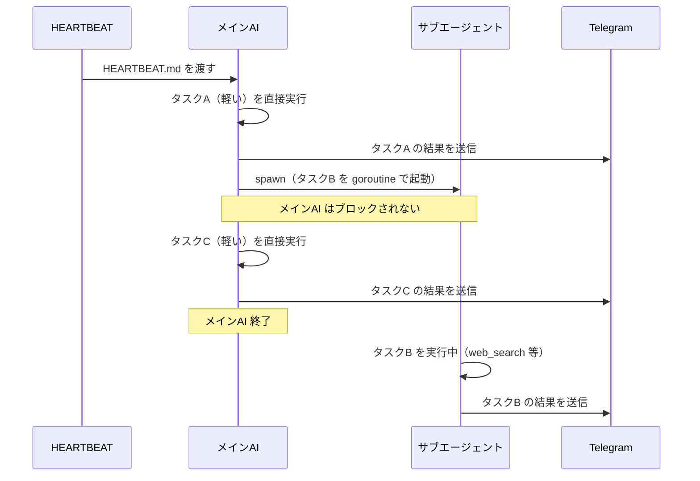
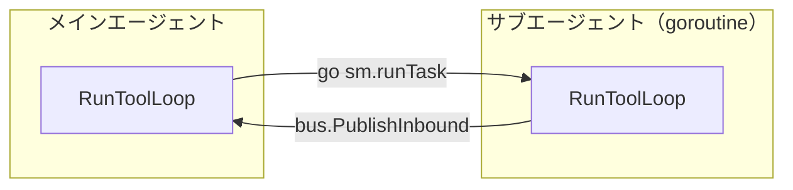

[picoclaw](https://github.com/sipeed/picoclaw) は Go で書かれた超軽量パーソナル AI エージェントだ。HEARTBEAT を試したところ「単なる cron ではないか」と思ったが、調べると違いがあった。

## HEARTBEAT とは

`~/.picoclaw/workspace/HEARTBEAT.md` に書いたタスクを定期的（デフォルト 30 分）に AI が読んで実行する仕組みだ。

workspace のディレクトリ構成は次のとおりで、`HEARTBEAT.md` は1つだけ存在する。

```
~/.picoclaw/workspace/
├── HEARTBEAT.md   # 定期タスクの定義
├── AGENT.md
├── IDENTITY.md
├── SOUL.md
├── USER.md
├── cron/
├── memory/
├── sessions/
├── skills/
├── state/
└── heartbeat.log
```

`HEARTBEAT.md` の中身はただの Markdown で、見出しや箇条書きはすべてユーザーが自由に書く。ファイル名や `# Periodic Tasks` といった見出し名にシステム上の意味はない。

```markdown
## Tasks

- 現在時刻を報告してください
- 簡単な挨拶を返してください
```

複数のタスクを依頼したい場合は箇条書きを並べるだけだ。AI はファイルの内容をまとめて1回のプロンプトで受け取り、すべてのタスクを順番に処理する。

### AI に渡るプロンプト

`heartbeat/service.go` の `buildPrompt()` がファイル内容を読み込み、現在時刻とともにプロンプトを組み立てる。

```go
now := time.Now().Format("2006-01-02 15:04:05")
return fmt.Sprintf(`# Heartbeat Check

Current time: %s

You are a proactive AI assistant. ...
If there is nothing that requires attention, respond ONLY with: HEARTBEAT_OK

%s`, now, content)
```

`Current time:` の行は Go コードが挿入する。末尾の `%s` に `HEARTBEAT.md` の全内容がそのまま埋め込まれる。

## cron との違い

一見すると cron と変わらないが、違いは **LLM が間に入る**点だ。

|              | cron                   | HEARTBEAT                        |
| ------------ | ---------------------- | -------------------------------- |
| タスク形式   | JSON 構造化            | 自然言語 Markdown                |
| 実行エンジン | スケジューラが直接実行 | AI が解釈して実行                |
| ツール利用   | なし                   | web 検索・ファイル操作・spawn 等 |

cron は「毎朝 9 時にメッセージを送れ」→ そのまま送る。HEARTBEAT は「ニュースをチェックして重要なものだけ教えて」→ AI が `web_search` を使って調べ、重要かどうか判断して、結果だけ Telegram に通知する。

ただし標準で使えるツールは `web_search`・`web_fetch`・ファイル操作・`exec` に限られ、メール・カレンダー等の統合は存在しない。「判断を AI に委ねられる」対象は Web 上の公開情報だ。メールのような認証が必要なものは事前に CLI ツールの準備が必要になる。

## spawn によるサブエージェントの非同期実行

HEARTBEAT 実行中に AI が重いタスクと判断したとき、`spawn` tool を呼んでサブエージェントをバックグラウンドで実行できる。



`spawn.go` を見ると `SubagentManager.Spawn()` は `go sm.runTask(...)` で goroutine を起動して即リターンする。`AsyncResult()` を返すのでメイン AI はブロックされない。

## forkするかどうかの判断はLLM任せ

「この処理は重いからforkしよう」という判定コードはプログラム側に**一切ない**。

`spawn` tool の description がそのまま LLM への判断基準になっている。

```go
func (t *SpawnTool) Description() string {
	return "Spawn a subagent to handle a task in the background. " +
		"Use this for complex or time-consuming tasks that can run independently. " +
		"The subagent will complete the task and report back when done."
}
```

さらにデフォルトの `HEARTBEAT.md` テンプレートにも明示的なヒントが書かれている。

```markdown
- For simple tasks (e.g., report current time), respond directly.
- For complex tasks that may take time, use the spawn tool to create a subagent.
- After spawning a subagent, CONTINUE to process remaining tasks.
```

つまり **プロンプトエンジニアリングで制御している**。

## subagent の実体

プロセスは起動せず、スレッドも作らない。`subagent.go` の `runTask` を見ると、実態はメインエージェントと同じ `RunToolLoop` 関数を goroutine で呼んでいるだけだ。



メインエージェントとの違いはセッション履歴がない点とシステムプロンプトが `SOUL.md` 等ではなく固定文字列な点だけだ。「fork」というより**使い捨ての LLM セッションを goroutine で実行する**が正確な表現だ。

## まとめ

picoclaw の HEARTBEAT が cron と異なる点は「コマンドを実行する」のではなく「AI が状況を判断して行動する」ことだ。spawn によるサブエージェントも、新プロセスのような大仰なものではなく goroutine + 使い捨て LLM セッションのシンプルな実装になっている。そしてすべての「判断」はプロンプトと tool description によるもので、プログラムに判定ロジックはない。
