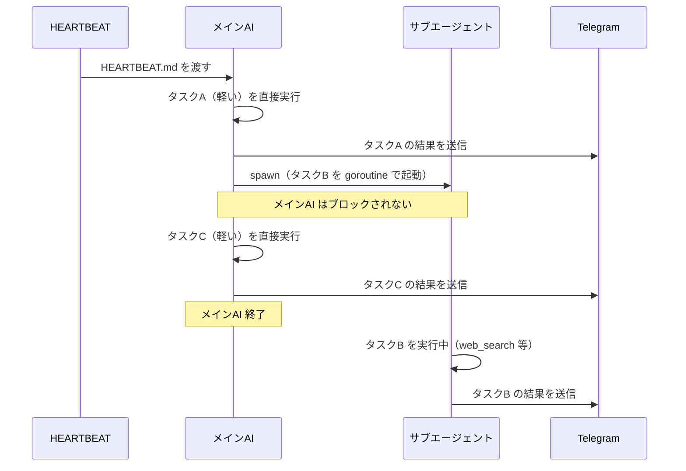
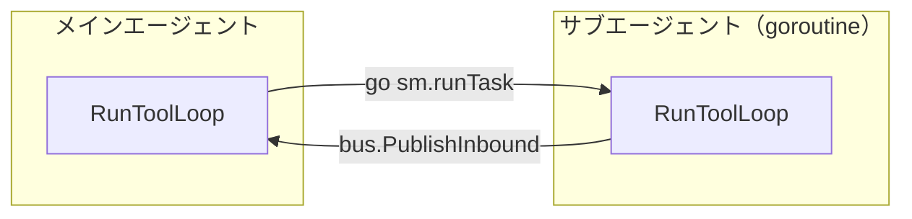

[picoclaw](https://github.com/sipeed/picoclaw) は Go で書かれた超軽量パーソナル AI エージェントだ。HEARTBEAT を試したところ「単なる cron ではないか」と思っていたが、自ら判断して行動を繰り返す様は、まるで人間のようだった。

## HEARTBEAT とは

`~/.picoclaw/workspace/HEARTBEAT.md` に書いたタスクを定期的（デフォルト 30 分）に AI が読んで実行する仕組みだ。

workspace のディレクトリ構成は次のとおりで、`HEARTBEAT.md` は1つだけ存在する。

```
~/.picoclaw/workspace/
├── HEARTBEAT.md   # 定期タスクの定義（本記事のテーマ）
├── cron/          # スケジュールジョブの定義（jobs.json）
├── heartbeat.log  # HEARTBEATの実行ログ
└── ...
```

`HEARTBEAT.md` の中身はただの Markdown で、見出しや箇条書きはすべてユーザーが自由に書く。

```markdown
## Tasks

- 現在時刻を報告してください
- 簡単な挨拶を返してください
```

複数のタスクを依頼したい場合は箇条書きを並べるだけだ。AI はファイルの内容をまとめて1回のプロンプトで受け取り、すべてのタスクを順番に処理する。

### AI に渡るプロンプト

`heartbeat/service.go` の `buildPrompt()` がファイル内容を読み込み、現在時刻とともにプロンプトを組み立てる。

```go
now := time.Now().Format("2006-01-02 15:04:05")
return fmt.Sprintf(`# Heartbeat Check

Current time: %s

You are a proactive AI assistant. ...
If there is nothing that requires attention, respond ONLY with: HEARTBEAT_OK

%s`, now, content)
```

`Current time:` の行は Go コードが挿入する。末尾の `%s` に `HEARTBEAT.md` の全内容がそのまま埋め込まれる。

## picoclaw 内蔵 cron との違い

picoclaw には HEARTBEAT とは別に cron 機能（`~/.picoclaw/workspace/cron/jobs.json`）がある。違いは **LLM が間に入るかどうか**だ。

|              | picoclaw cron              | HEARTBEAT                        |
| ------------ | -------------------------- | -------------------------------- |
| タスク定義   | JSON 構造化                | 自然言語 Markdown                |
| 実行エンジン | スケジューラがコマンド実行 | AI が解釈して実行                |
| ツール利用   | 不可                       | web 検索・ファイル操作・spawn 等 |

cron は「毎朝 9 時にメッセージを送れ」→ そのまま送る。HEARTBEAT は「ニュースをチェックして重要なものだけ教えて」→ AI が `web_search` を使って調べ、重要かどうか判断して、結果だけ Telegram に通知する。

ただし標準で使えるツールは `web_search`・`web_fetch`・ファイル操作・`exec` に限られ、メール・カレンダー等の統合は存在しない。「判断を AI に委ねられる」対象は Web 上の公開情報だ。メールのような認証が必要なものは事前に CLI ツールの準備が必要になる。

## spawn によるサブエージェントの非同期実行

HEARTBEAT 実行中に AI が重いタスクと判断したとき、`spawn` tool を呼んでサブエージェントをバックグラウンドで実行できる。



`spawn.go` を見ると `SubagentManager.Spawn()` は `go sm.runTask(...)` で goroutine を起動して即リターンする。`AsyncResult()` を返すのでメイン AI はブロックされない。

## forkするかどうかの判断はLLM任せ

「この処理は重いからforkしよう」という判定コードはプログラム側に**一切ない**。

`spawn` tool の description がそのまま LLM への判断基準になっている。

```go
func (t *SpawnTool) Description() string {
	return "Spawn a subagent to handle a task in the background. " +
		"Use this for complex or time-consuming tasks that can run independently. " +
		"The subagent will complete the task and report back when done."
}
```

> タスクをバックグラウンドで処理するサブエージェントを起動する。独立して実行できる複雑または時間のかかるタスクに使用すること。サブエージェントはタスクを完了したら結果を報告する。

さらにデフォルトの `HEARTBEAT.md` テンプレートにも明示的なヒントが書かれている。

```markdown
- For simple tasks (e.g., report current time), respond directly.
- For complex tasks that may take time, use the spawn tool to create a subagent.
- After spawning a subagent, CONTINUE to process remaining tasks.
```

つまり **プロンプトエンジニアリングで制御している**。

## subagent の実体

プロセスは起動せず、スレッドも作らない。`subagent.go` の `runTask` を見ると、実態はメインエージェントと同じ `RunToolLoop` 関数を goroutine で呼んでいるだけだ。



メインエージェントとの違いはセッション履歴がない点とシステムプロンプトが `SOUL.md` 等ではなく固定文字列な点だけだ。「fork」というより**使い捨ての LLM セッションを goroutine で実行する**が正確な表現だ。

## spawn は本当に発火するのか

コードを読んだだけでは「spawn が実際に呼ばれるのか」は分からない。2パターンの `HEARTBEAT.md` を用意して `picoclaw gateway` を起動し、spawn が発火する条件を検証した。使用モデルは `gpt-oss-120b`（vllm）。

### パターン1：デフォルト指示 + 軽いタスク → spawn 不発火

デフォルトテンプレートの Instructions（`For complex tasks... use the spawn tool`）を復元し、3タスクを書いた。

```markdown
## Instructions

- Execute ALL tasks listed below. Do NOT skip any task.
- For simple tasks (e.g., report current time), respond directly.
- For complex tasks that may take time, use the spawn tool to create a subagent.
- The spawn tool is async - subagent results will be sent to the user automatically.
- After spawning a subagent, CONTINUE to process remaining tasks.
- Only respond with HEARTBEAT_OK when ALL tasks are done AND nothing needs attention.

## Tasks

- 現在時刻を報告してください
- Go言語のgoroutineとOSスレッドの技術的な違いを500文字以上の詳細なレポートにまとめてください
- 「picoclaw」に関する最新情報をweb検索して要約してください
```

**結果：spawn は1回も呼ばれなかった。** メイン AI は 4 iteration で `web_search` → `web_fetch` を直接使い、全タスクを直接処理した。

### パターン2：指示なし + AI Agent 調査タスク → spawn 発火

同じく Instructions セクションを削除し、タスクだけを書いた。

```markdown
## Tasks

- AI Agent設計パターン — AIエージェントのアーキテクチャ・ベストプラクティス調査を2025年以降の記事で100件取得し、レポートを１つのmdにまとめて
```

**結果：spawn が1回呼ばれた。** パターン1と異なり、わずか1回の `web_search` で「100件は自力では無理」と判断した。iteration 2 で即座に spawn へ切り替えた。

```
iteration 1: web_search("AI agent design patterns 2025")
iteration 2: spawn({"label":"AI Agent Design Patterns Report", "task":"Research AI agent design pattern best practices. Find 100 articles published in 2025 or later..."})  ← ここで spawn
iteration 3: HEARTBEAT_OK
```

サブエージェントは起動したものの、ツールが0個のため 1 iteration で終了し、119文字の JSON 断片だけを返して完了した。

`heartbeat.log` の記録は次のとおり。

```
[2026-02-22 21:09:27] [INFO] Resolved channel: , chatID:  (from lastChannel: )
[2026-02-22 21:09:35] [INFO] Heartbeat OK - silent
```

spawn が発火しても `heartbeat.log` には「Heartbeat OK - silent」しか記録されない。これは `cmd_gateway.go` の handler が全レスポンスを `SilentResult` で包むためだ。spawn の発火はアプリケーションログ（`--debug` モード）でのみ確認できる。

## spawn されても成果物が出ない：サブエージェントにツールがない

パターン2では spawn が発火したが、サブエージェントが生成した成果物は**103文字の JSON 断片だけ**だった。md レポートは作られていない。

```
subagent-1 completed → content_len=103
toolloop iteration=1 → LLM response without tool calls {content_chars=103}
```

サブエージェントは1 iteration でツールを1つも呼ばずに終了した。原因はコードにある。`loop.go` の `registerSharedTools()` でサブエージェントマネージャを作った後、**ツールを一切登録していない**。

```go
// loop.go:139-146
subagentManager := tools.NewSubagentManager(provider, agent.Model, agent.Workspace, msgBus)
subagentManager.SetLLMOptions(agent.MaxTokens, agent.Temperature)
spawnTool := tools.NewSpawnTool(subagentManager)
// ... allowlist設定 ...
agent.Tools.Register(spawnTool)
// ← subagentManager.SetTools() も RegisterTool() も呼んでいない
```

`NewSubagentManager` は空のレジストリで初期化される。

```go
// subagent.go:52
tools: NewToolRegistry(),  // 空
```

### PR #493 で修正予定

PRを出すチャンスだと思ったけど、調べたらもうPR出てたorz  
 [PR #493: fix(agent): share agent tools with subagent manager](https://github.com/sipeed/picoclaw/pull/493)

## まとめ

picoclaw の HEARTBEAT が cron と異なる点は「コマンドを実行する」のではなく「AI が状況を判断して行動する」ことだ。spawn によるサブエージェントも、新プロセスのような大仰なものではなく goroutine + 使い捨て LLM セッションのシンプルな実装になっている。  
自分としては、プロンプトで分岐させているところが面白く、学びもあった。
